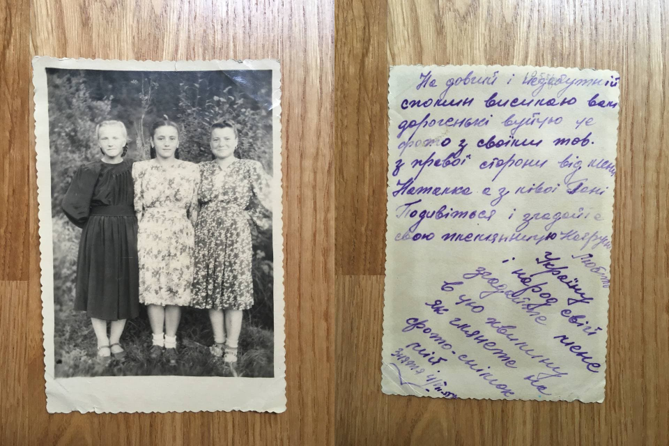

# Paspartu - add caption to your photo without losing quality

Few month ago I started to digitize by old family photo albums.
Those old photos have been glued to the album pages and when I pilled them off, 
I noticed that a lot of photos had a handwritten massage on the back. 

Of course, I've seen those before, but this time I finally understood how valuable they
are.

The most powerful virtue of the photo is not photo itself, but the story behind it. 
Who made a shot? When? Where? Who are those people on the photo? Why did they decide to 
make it in the first place? 

Those are the things we are interested in when we look through old photos. 
And photos without context have only historical value.
