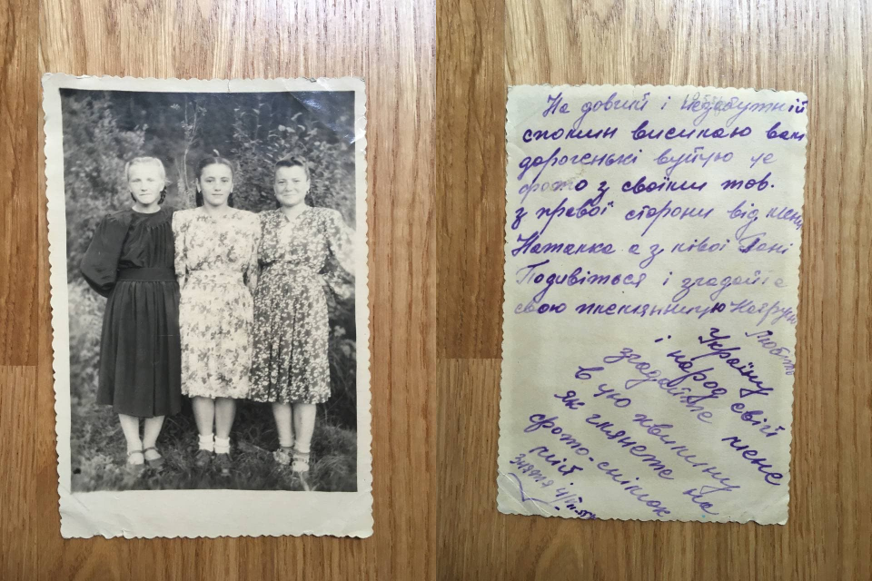
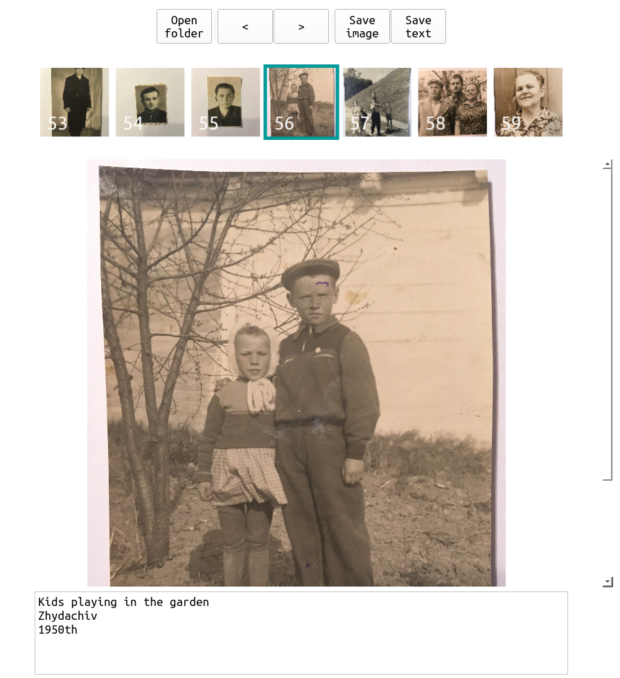

# Paspartu - preserve the stories behind your old photos

### Motivation

Few month ago I started to digitize by old family photo albums.
Those old photos have been glued to the album pages and when I pilled them off, 
I noticed that a lot of pictures had a handwritten massage on the back. 



Of course, I've seen those before, but this time I understood for the first time how 
immensely valuable they are.

If you think about it, what is the most important component of the photo? Its quality? Rarity? Form? Significance of 
the person or event captured? Story behind the photo? 

Possibly each of those is important in its own way. But it seems to be that the most powerful virtue is the 
story behind the photograph. Who made a shot? When? Where? Who are those people on the photo? What were the 
circumstances of its creation? Where are those people now? Those are the things we ask when we look through 
old photo albums. And old photos without context have little value, especially if we are talking 
about family pictures, which rarely depict anything of historical significance.

Besides messages on the back of the photographs, the most important "photo metadata" is stored in the form of 
memories of your elder relatives. But memory is fragile thing, as well as human life. 
It is lost if it is not preserved in time.

I came to me that it's really important to preserve old photos' stories for my ancestors 
(or other relatives interested in our family history). And I wanted to do it as soon as possible, while
people who can tell these stories are still alive.
 
 This led to the creation of this tool. I wanted it to be simple, fast and offline. So in case its functionality
 seems limited to you, it is so by design. 

### Tool

This tool allows you to save text annotations to your photos in the form of plain text files 
or [passe-partout](https://en.wikipedia.org/wiki/Mat_(picture_framing))-like captioned framing.



Functionality:

| Key or shortcut | Function |
|:---           |:---      |
|`Ctrl+=` shortcut or `+` button    | increase scale |
|`Ctrl+-` shortcut or `-` button     | decrease scale |
|`Alt+Left` shortcut or `<` button    | move to left image |
|`Alt+Right` shortcut or `>` button   | move to right image |
|`Open folder` button | open folder with images for annotation |
|`Save text` button | save image annotation as a text file in `annotation` folder |
|`Save image` button| save image with a frame and a captino in `target` folder |

### Workflow

0) Prerequisites:
    ```
    python >= 3.7
    pip >= 19.2.3
    ```
1) Install required packages
    ```shell script
    pip install -r requirements.txt
    ```
2) Launch tool:
    ```shell script
    python paspartu.py
    ```
3) Open folder with your images (it can take a bit since all images are loaded into memory).
4) Go through images, add notes, dates, etc.
5) Save photo metadata by clicking `Save text` or `Save photo` (Images with saved text become greyscale).

> 2 folders are created in chosen directory: `target` and `annotations`. 
> Former for captioned images and later for text annotation files.

### Contribution

Feel free to contribute to this project if you like it.
Any suggestions, comments or bug reports are appreciated.
