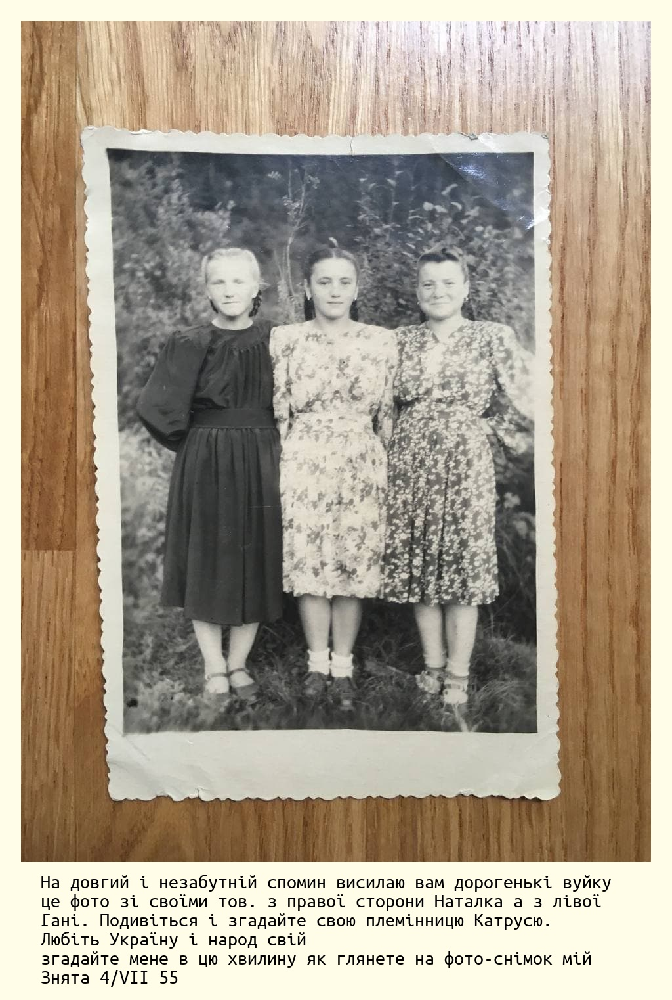

# Paspartu - caption your old photos

#### Motivation

Few month ago I started to digitize by old family photo albums.
Those old photos have been glued to the album pages and when I pilled them off, 
I noticed that a lot of photos had a handwritten massage on the back. 


Of course, I've seen those before, but this time I finally understood how valuable they
are.

The most powerful virtue of the photo is not photo itself, but the story behind it. 
Who made a shot? When? Where? Who are those people on the photo? Why did they decide to 
make it in the first place? 

Those are the things we are interested in when we look through old photos. 
And old photos without context have only historical value.

Old photos also have another special type of metadata in the form of memories of your 
elder relatives. But memory is fragile thing, as well as human life is. It is lost if it is not preserved.

I decided that it's really important to write down old photos' metadata for my ancestors 
(or other relatives interested in our family history). This led to the creation of this tool.

#### Tool

This tool allows you to add arbitrary-size caption to your photos without losing 
image quality.



Functionality:

- Zoom (`Ctrl +` / `Ctrl -`)
- Supported formats: PNG and JPEG
- Original image quality is preserved
- Font size is controlled by `TEXT_WIDTH` constant, which defines # of characters per line
- Font face is controlled by the `FONT_PATH` constant. You can use your custom font if you would like.

#### Workflow

0) Prerequisites:
    ```
    python >= 3.7
    pip >= 19.2.3
    ```
1) Install required packages
    ```shell script
    pip install -r requirements.txt
    ```
2) Launch tool:
    ```shell script
    python paspartu.py
    ```
3) Open image (`Open` button)
4) Enter text in text box
5) Save captioned image (`Save` button)
> 2 folders are created in image parent directory: `target` and `backup`. 
> Former for captioned images and later for original ones.

#### Contribution

Feel free to contribute to this project if you like it.
Any suggestions and comments are appreciated.


